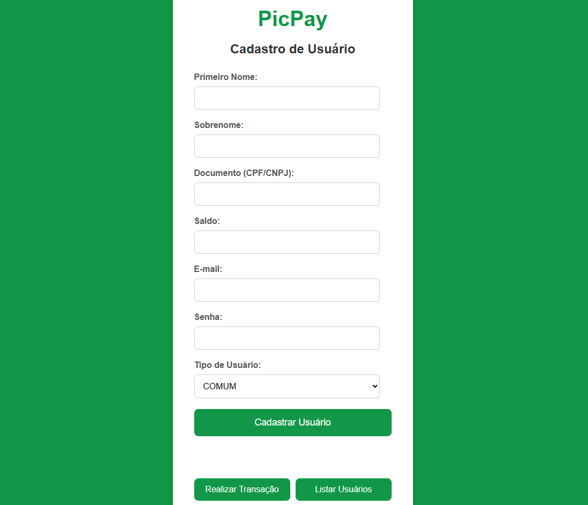
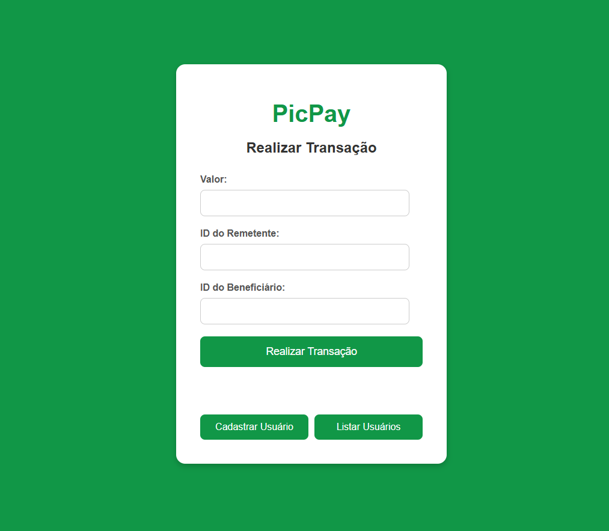
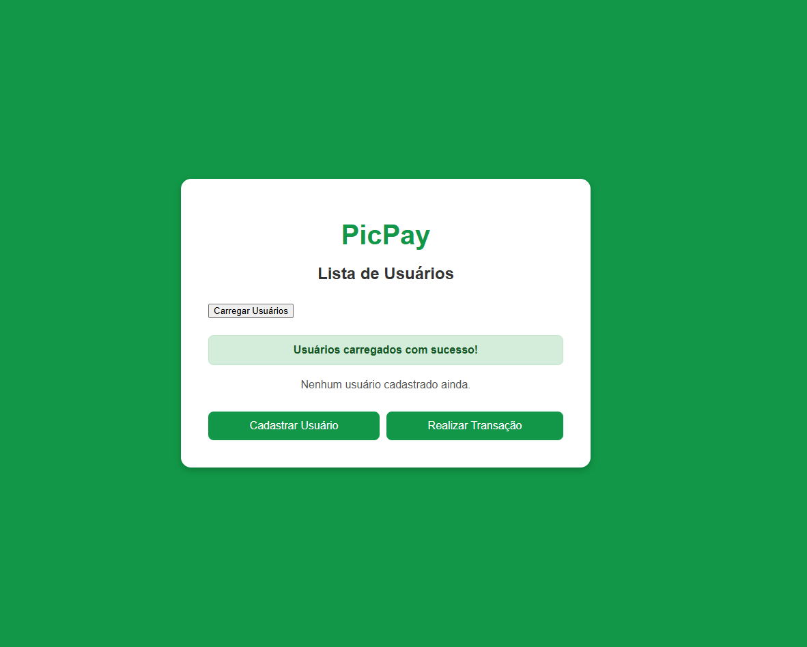

# PicPay Simplificado - Desafio Back-end

Este projeto é a implementação do desafio de back-end do PicPay, focado na criação de uma plataforma de pagamentos simplificada que permite depósitos e transferências de dinheiro entre diferentes tipos de usuários.

## 🚀 Objetivo do Projeto

O objetivo principal é simular o fluxo de transferência de dinheiro entre usuários, com validações de negócio, comunicação com serviços externos (autorização e notificação) e tratamento transacional.

## 💻 Tecnologias Utilizadas

* **Linguagem:** Java 21
* **Framework:** Spring Boot 3.1.2
* **Banco de Dados:** H2 Database (em memória, para ambiente de desenvolvimento e testes)
* **Gerenciador de Dependências:** Apache Maven
* **Testes:** JUnit 5 (Spring Boot Starter Test)

## 🚀 Como Rodar a Aplicação (Backend)

### Pré-requisitos

* Java Development Kit (JDK) 21 ou superior.
* Apache Maven.

### Passos

1.  **Clone o repositório:**
    ```bash
    git clone [LINK_DO_SEU_REPOSITORIO]
    cd picpay-simplificado/picpaysimplificado
    ```
2.  **Execute a aplicação:**
    Você pode iniciar o Spring Boot utilizando o Maven Wrapper:
    ```bash
    ./mvnw spring-boot:run
    ```
    Ou, se preferir, execute a classe principal `PicpaysimplificadoApplication.java` diretamente da sua IDE.

A aplicação estará disponível em `http://localhost:8080`.

## ⚙️ Endpoints da API

A API é RESTful e permite as seguintes operações:

### Base URL

`http://localhost:8080`

### 👥 Usuários

* **`POST /users`**
    * **Descrição:** Cria um novo usuário (comum ou lojista).
    * **Request Body (JSON - `UserDTO`)**:
        ```json
        {
          "firstName": "João",
          "lastName": "Silva",
          "document": "12345678900", // CPF ou CNPJ
          "balance": 1000.00,
          "email": "joao.silva@example.com",
          "password": "senha",
          "userType": "COMMON" // ou "MERCHANT"
        }
        ```
* **`GET /users`**
    * **Descrição:** Lista todos os usuários cadastrados no sistema.

### 💰 Transações

* **`POST /transactions`**
    * **Descrição:** Realiza uma transferência de dinheiro entre dois usuários.
    * **Request Body (JSON - `TransactionDTO`)**:
        ```json
        {
          "value": 50.00,
          "senderId": 1,    // ID do usuário remetente
          "receiverId": 2   // ID do usuário/lojista beneficiário
        }
        ```

## 📐 Estrutura do Projeto

O projeto segue uma arquitetura baseada em camadas, comum em aplicações Spring Boot:

* `com.picpaysimplificado.domain`: Contém as entidades de negócio (`User`, `Transaction`) e enums (`UserType`).
* `com.picpaysimplificado.dtos`: Contém os Objetos de Transferência de Dados (DTOs) utilizados nas requisições e respostas da API.
* `com.picpaysimplificado.repositories`: Interfaces de repositório Spring Data JPA para acesso e persistência de dados.
* `com.picpaysimplificado.services`: Camada de serviço, contendo a lógica de negócio e as regras de validação.
* `com.picpaysimplificado.controllers`: Camada de controllers REST, que expõe os endpoints da API.
* `com.picpaysimplificado.infra`: Classes de infraestrutura, como configurações gerais (`AppConfig`) e o manipulador global de exceções (`ControllerExceptionHandler`).
* `com.picpaysimplificado.exceptions`: Contém exceções personalizadas para tratamento de erros específicos de negócio.

## 🔑 Regras de Negócio Implementadas

* **Tipos de Usuário:** `COMMON` (comum) e `MERCHANT` (lojista).
* **Unicidade:** CPF/CNPJ e endereços de e-mail devem ser únicos no sistema.
* **Permissões de Transferência:**
    * Usuários `COMMON` podem enviar dinheiro para lojistas e outros usuários.
    * Lojistas (`MERCHANT`) **só podem receber** transferências, não enviar.
* **Validação de Saldo:** O usuário remetente deve ter saldo suficiente para a transferência.
* **Serviço Autorizador Externo:** Antes de finalizar a transferência, é consultado um serviço mock externo (`https://util.devi.tools/api/v2/authorize` usando GET) para simular a autorização.
* **Transação Atômica:** A operação de transferência é transacional, garantindo que o dinheiro volte para a carteira do usuário que envia em caso de qualquer inconsistência.
* **Serviço de Notificação:** Um serviço mock externo (`https://util.devi.tools/api/v1/notify` usando POST) é utilizado para simular o envio de notificação aos usuários após o recebimento de pagamento. Este serviço é tratado para ser tolerante a falhas (simulando indisponibilidade/instabilidade).

## 🚨 Tratamento de Erros

O projeto implementa um tratamento global de exceções usando `@RestControllerAdvice` e `@ExceptionHandler`, garantindo que a API retorne respostas padronizadas e descritivas para diferentes cenários:

* **`400 Bad Request`**: Para erros de validação (ex: CPF/e-mail duplicado, regras de transação como tipo de usuário/saldo insuficiente).
* **`404 Not Found`**: Para recursos não encontrados (ex: usuário por ID).
* **`403 Forbidden`**: Especificamente para transações não autorizadas pelo serviço externo, retornando uma mensagem amigável ao usuário final.
* **`500 Internal Server Error`**: Para erros inesperados no servidor.

## 📸 Demonstração / Interface de Usuário (Exemplo)

Para facilitar a interação e visualização das funcionalidades da API, foram desenvolvidas algumas páginas HTML/JavaScript. Abaixo, uma prévia da interface:

### Tela de Cadastro de Usuário


### Tela de Realizar Transação


### Tela de Listar Usuários


_Nota: O frontend foi desenvolvido apenas para fins de demonstração e não é o foco principal da avaliação deste desafio._